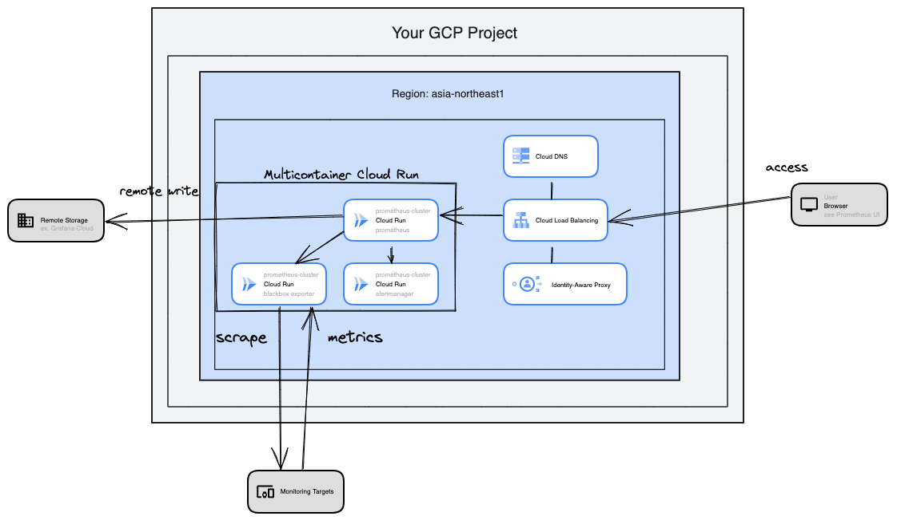

# cloudrun-prometheus-boilerplate-infra

This repository is an infrastructure example for [cloudrun-prometheus-boilerplate](https://github.com/aiwasaki126/cloudrun-prometheus-boilerplate).

## Architecture

### Overview



### Main Resources

Resources are mainly composed of

- Cloud Run (multicontainer)
- Cloud Load Balancing
- Identity Aware Proxy
- Secret Manger
- Cloud DNS

Terraform modules from [terraform-modules-google-cloud](https://github.com/aiwasaki126/terraform-modules-google-cloud) are used.

## Deployment

In the end of deployment, you can access Prometheus UI from URL `https://prometheus.<YOUR DOMAIN>` (ex. `https://prometheus.example.com`).

### Prerequisite

- You have Google Cloud Project.
- You have a domain.
- You have installed terraform on your PC.

### 1. Setup

#### 1.1 Enabling Identity Aware Proxy

See [IAP guide](https://cloud.google.com/iap/docs/programmatic-oauth-clients?hl=ja). 
Setup OAuth consent screen.

#### 1.2 Create GCS Bucket to Store tfstate 

```bash
gsutil mb -p <YOUR GCP PROJECT ID> -c STANDARD -l <DEFAULT REGION> -b on gs://<YOUT GCS BUCKET THAT STORE TFSTATE FILE>
```

#### 1.3 Rewrite Backend Bucket (in `backend.tf`)

Rewrite the bucket name in `backend.tf` by defined in 1.2.

```
  backend "gcs" {
    bucket = "<YOUT GCS BUCKET THAT STORE TFSTATE FILE>"
    prefix = "gcp"
  }
```

#### 1.4 Rewrite Values as you like (in `values.tf`)

```
locals {
  project = {
    id             = "<YOUR GCP PROJECT ID>"
    number         = "<YOUR GCP PROJECT NUMBER>"
    default_region = "<DEFAULT REGION>"
    default_zone   = "<DEFAULT ZONE>"
  }

  labels = {
    env = "dev"
  }

  dns = {
    top_domain   = "<YOUR DOMAIN>" # ex. example.com
    service_name = "main"
  }
~
```

### 2. Deployment

At the root in this repository, run commands below.

```bash
terraform init
```

Then, you can do dry-run before createing resources.

```bash
terraform plan
```

If there is no problem, run:

```bash
terraform apply
```

### 3. Enabling IAP for Load Balancer

After deployment, you must enable IAP for LB to access Prometheus UI.
See [IAP guide](https://cloud.google.com/iap/docs/load-balancer-howto?hl=ja#enable-iap).


